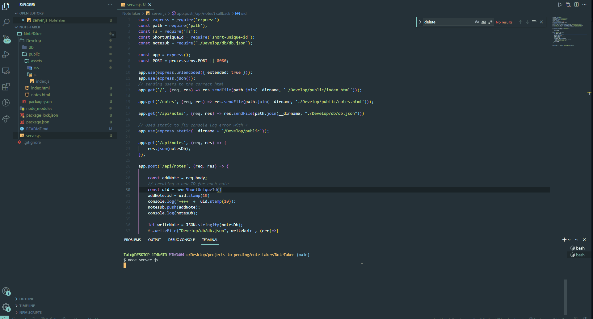

## NoteTaker

<!-- PROJECT LOGO -->
 

    

  <h3 align="center">Note-Taker</h3>
     
    <a href="https://ayad-note-taker.herokuapp.com/"><strong>Explore the Website ON Heroku »</strong></a>
     
  

    An awesome app to save your notes
  

<!-- TABLE OF CONTENTS -->

  
Table of Contents

  <ol>
    <li>
      <a href="#about-the-project">About The Project</a>
      <ul>
        <li><a href="#built-with">Built With</a></li>
      </ul>
    </li>
    <li><a href="#installation">Installation</a></li>
    <li><a href="#usage">Usage</a></li>
    <li><a href="#licens">Licens</a></li>
    <li><a href="#credits">Credits</a></li>
  </ol>

<!-- ABOUT THE PROJECT -->

## About The Project

Note-taker is an application that allows users to save their notes.

### Built With

- [JavaScript](https://www.javascript.com/)
- [HTML](https://www.HTML.com/)
- [CSS](https://www.CSS.com/)
- [Node.Js](https://nodejs.org/en/)
- [NPM](https://www.npmjs.com/)
- [UNIQUE-ID](https://www.npmjs.com/package/short-unique-id)
- [EXPRESS](https://www.npmjs.com/package/express)

## Installation

Clone the application
Run `npm install` to install the dependencies
Run `npm install express`
Run `npm i short-unique-id`

## Usage

This application is for
Open the terminal
Type `node server.js` to run the application.
The application is going to start and you can use it by opening your browser=

## License

This project is licensed under the terms of the [MIT](https://opensource.org/licenses/MIT) license.

## Credits

1. https://www.w3schools.com/
2. https://stackoverflow.com/
3. https://github.com/
4. https://docs.npmjs.com/
